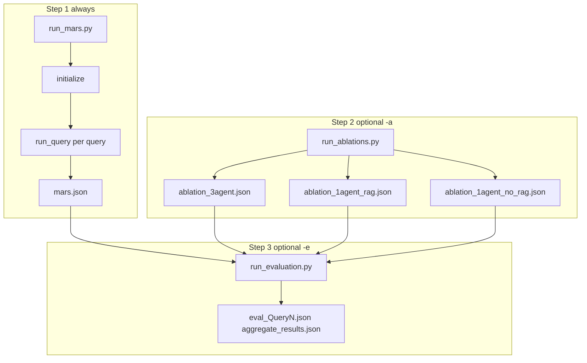

# MARS: Ablation Study and LLM-as-Judge Evaluation

This document describes **how the ablation conditions and automated evaluation actually run** in this repository: entry points, data loaded at runtime, prompts, on-disk artifacts, and how the judge consumes them. Implementation references: [`scripts/run_mars.py`](../scripts/run_mars.py), [`scripts/run_ablations.py`](../scripts/run_ablations.py), [`scripts/run_evaluation.py`](../scripts/run_evaluation.py), [`src/runner.py`](../src/runner.py), [`src/utils/evaluation_export.py`](../src/utils/evaluation_export.py), [`src/utils/ablation_utils.py`](../src/utils/ablation_utils.py), [`config/prompts.yaml`](../config/prompts.yaml) (`ablation` section), [`config/evaluation_rubric.yaml`](../config/evaluation_rubric.yaml), and [`run_experiments.sh`](../run_experiments.sh).

For the full MARS pipeline’s use of knowledge graphs and RAG in Systems 1–3, see [`MARS_AND_KNOWLEDGE_SOURCES.md`](MARS_AND_KNOWLEDGE_SOURCES.md).

---

## What This Framework Does

The benchmark uses **the same queries** for every condition (from [`config/queries.yaml`](../config/queries.yaml), loaded via [`load_ablation_queries`](../src/utils/ablation_utils.py)). For each query you obtain up to **four comparable JSON exports**:

| Role in judge code | Meaning | Typical file |
|--------------------|---------|----------------|
| **`evaluation`** | Full MARS pipeline (Systems 1 → 2 ↔ 3) | [`results/<QueryName>/mars.json`](../results/) (copy of `artifacts/evaluation_<id>.json`) |
| **`ablation_3agent`** | Three sequential LLM calls, no retrieval | `results/<QueryName>/ablation_3agent.json` |
| **`ablation_1agent_rag`** | One LLM call after fixed pre-retrieval | `results/<QueryName>/ablation_1agent_rag.json` |
| **`ablation_1agent_no_rag`** | One LLM call, no external context | `results/<QueryName>/ablation_1agent_no_rag.json` |

The **LLM-as-judge** script reads those four payloads (per query), **anonymizes** them as labels A–D, scores them on a fixed rubric, and writes per-query and aggregate results.

---

## End-to-End: What Runs When You Execute the Shell Driver

[`run_experiments.sh`](../run_experiments.sh) always runs **Step 1** only unless you pass flags:

1. **Step 1 (always):** `python scripts/run_mars.py --queries "$QUERIES"` — full MARS for each selected query.
2. **Step 2 (if `-a` / `--ablations`):** `python scripts/run_ablations.py` with the same query list and optional `--condition` (single ablation) or all three conditions by default.
3. **Step 3 (if `-e` / `--eval`):** `python scripts/run_evaluation.py --queries "$QUERIES"` — judge evaluation.

**Dependency:** Step 3 expects **all four** JSON artifacts for each query directory under `results/` (see [Discovery rules](#llm-as-judge-discovery-and-input-files)). In practice you run Step 1, then Step 2, then Step 3 (or use `./run_experiments.sh -a -e` after a full MARS run).

---

## Baseline: Full MARS (`run_mars.py`)

[`scripts/run_mars.py`](../scripts/run_mars.py):

1. Loads [`config/config.yaml`](../config/config.yaml) via `load_config()`.
2. Loads queries with `load_ablation_queries()` (same file as ablations: `config/queries.yaml`, or `config/ablation_queries.yaml` if the primary file is missing).
3. Calls **`initialize(config)`** once — full strict load of graphs, Chroma, material DB, agents (see [`MARS_AND_KNOWLEDGE_SOURCES.md`](MARS_AND_KNOWLEDGE_SOURCES.md)).
4. For each query, calls **`run_query(components, query, output_dir)`** with `output_dir = <project>/results/<QueryName>/`.

Inside [`run_query`](../src/runner.py), detailed stage JSON and logs are written under **`results/<QueryName>/artifacts/`** (e.g. `system1_*.json`, `system2_*.json`, `system3_*.json`, `pipeline_run_*.json`, `rejected_candidates.json`). After the run, [`save_evaluation_export`](../src/utils/evaluation_export.py) builds a consolidated payload via [`build_evaluation_payload`](../src/utils/evaluation_export.py) and saves `artifacts/evaluation_<pipeline_run_id>.json`. The same payload is **copied** to **`results/<QueryName>/mars.json`** at the query root. That file is what the judge loads as the **“MARS (Full Pipeline)”** system.

This baseline includes **iterative** System 2 ↔ System 3 loops, dual-KG subgraph construction, `MultiAnalyst` RAG, feedback constraints, etc. — none of which the ablation scripts replicate.

---

## Ablation Runner (`run_ablations.py`)

Entry: **`python scripts/run_ablations.py`** with optional arguments:

| Argument | Default | Effect |
|----------|---------|--------|
| `--queries` | all queries in YAML | Comma-separated **names** (e.g. `Query1,Query2`) |
| `--condition` | none (run all) | One of `3agent`, `1agent_rag`, `1agent_no_rag` |
| `--output-dir` | `results` | Root directory; per-query folder is `<output-dir>/<QueryName>/` |

It loads **`prompts["ablation"]`** from [`config/prompts.yaml`](../config/prompts.yaml) and instantiates the project LLM via [`src.utils.llm`](../src/utils/__init__.py) using **`config["llm"]`**: `api_key`, `base_url`, `model_name`, `max_tokens`, and **`generate_cli`** as the callable. Temperature defaults to `config["llm"].get("temperature", 0)`.

For **each** selected condition and **each** query, it writes:

**`<project>/<output-dir>/<QueryName>/ablation_<condition>.json`**

(e.g. `results/Query1/ablation_3agent.json`).

---

## Ablation Conditions: Exact Runtime Behavior

### Condition `3agent` — three LLM calls, no RAG / no KG

[`run_3agent_ablation`](../scripts/run_ablations.py):

1. **Agent 1:** System + user prompts `agent1_properties` / `agent1_properties_user_prompt` with `sentence`, `material_X`, `application_Y`. Response must be JSON with `properties` and `constraints`. Parsed with [`extract_json_from_response`](../src/utils/ablation_utils.py); if parsing fails, empty lists are used.
2. **Agent 2:** `agent2_candidate` / `agent2_candidate_user_prompt` with properties and constraints as JSON strings. Expected fields include `material_name`, `material_class`, `justification`. On parse failure, a placeholder candidate is used.
3. **Agent 3:** `agent3_manufacturing` / `agent3_manufacturing_user_prompt` with candidate fields plus properties/constraints. On parse failure, a dict with `status: "unknown"` and raw text in `feedback_to_system2` is used.

No `ResearchAnalyst`, no Chroma, no `ResearchScientist`, no material database file access.

The final object is assembled with [`build_ablation_evaluation`](../src/utils/ablation_utils.py) (`condition_name="3agent"`), including **`raw_responses`** keyed by step name.

### Condition `1agent_rag` — retrieval, then one LLM call

**Resource load** runs **only if** `1agent_rag` is among the conditions to run ([`_init_rag_resources`](../scripts/run_ablations.py)):

- **SentenceTransformer** from `config["embeddings"]["model_name"]` and [`TransformerEmbeddingFunction`](../src/utils/__init__.py).
- **Three KGs** from `config["data"]["graphs"]`: material_properties, pfas, patents — GraphML + pickled embeddings via `GraphReasoning.load_embeddings`; edge attribute `title` copied to `relation` (same normalization as main runner).
- **Four Chroma collections:** `pfas`, `patents`, `materialdb`, and **`manufacturing_textbooks`** (required, same as full MARS) under `data.chromadb.base_path` + each entry’s `database_path`; collection name from config or the first collection in the persist directory.
- **Four [`ResearchAnalyst`](../src/agents/research_analyst.py) instances:** `pfas` / `patents` / `materialdb` use `n_results` from **`config["agents"]["research_analyst"]["n_results"]`**; **`manufacturing_textbooks`** uses **`config["pipelines"]["manufacturability_assessment"]["n_results_per_source"]`** (fallback: same as `research_analyst.n_results`), matching System 3’s process analyst.
- **Three [`ResearchScientist`](../src/agents/research_scientist.py) instances**, one graph each, `algorithm="shortest"`.
- **`MaterialDatabase`** from `config["data"]["material_database"]["path"]` with a [`PropertyMapper`](../src/utils/property_mapper.py) (embedding model as in script).

**Pre-retrieval** [`_pre_retrieve_context`](../scripts/run_ablations.py) (fixed behavior):

- For **each** RAG source (`pfas`, `patents`, `materialdb`, `manufacturing_textbooks`): `analyst.analyze_question(query["sentence"])` — the **full benchmark sentence**, no keyword filter.
- For **each** KG (`material_properties`, `pfas`, `patents`): `scientist.find_connections([material_X, application_Y])`.
- Formats RAG with [`format_rag_results_for_prompt`](../src/utils/ablation_utils.py) (per-doc char cap default 3000) and KG with [`format_kg_results_for_prompt`](../src/utils/ablation_utils.py) (summary truncated at 5000 chars; path counts and matched node preview).
- Appends a **full list** of materials from `material_db.materials` (`material_name` / `material_id` and `material_class`).

**Single LLM call:** `single_agent_with_context` / `single_agent_with_context_user_prompt` with the concatenated context block. The model must return **one** JSON object with top-level keys `required_material_properties`, `candidate_selection`, `manufacturing_process` (see prompts file for the exact schema). The script parses with `extract_json_from_response`, then maps into `build_ablation_evaluation` (properties/constraints from `required_material_properties`; candidate from `candidate_selection.final_candidate`; manufacturing from `manufacturing_process`). **`raw_responses`** includes the full model output and `retrieved_context_chars`.

This path is **not** equivalent to full MARS: it does not build the dual-KG merged subgraph, does not run `MultiAnalyst` validation loops, and does not execute the manufacturability pipeline in [`manufacturability_assessment.py`](../src/pipelines/manufacturability_assessment.py).

### Condition `1agent_no_rag` — one LLM call, no retrieval

[`run_1agent_no_rag_ablation`](../scripts/run_ablations.py): `single_agent_no_context` / `single_agent_no_context_user_prompt` only; same JSON parsing and `build_ablation_evaluation` mapping as `1agent_rag`, without loading any graphs or Chroma.

---

## Ablation Output Schema (`build_ablation_evaluation`)

[`build_ablation_evaluation`](../src/utils/ablation_utils.py) normalizes ablation runs into the **same top-level shape** as the MARS evaluation export:

- `query`: `sentence`, `material_X`, `application_Y`
- `required_material_properties`: `properties`, `constraints`
- `candidate_selection`: `final_candidate` (subset of fields), **`rejected_candidates`: []**
- `manufacturing_process`: `status`, `process_recipe`, `blocking_constraints`, `feedback_to_system2`
- `metadata`: includes `pipeline_run_id` (timestamp-based id in ablations), `timestamp`, `final_outcome_status`, **`total_iterations`: 1**, **`total_rejected_candidates`: 0**, **`ablation_condition`**, **`duration_seconds`**

Ablations may include **`raw_responses`**; the judge strips this before scoring ([`strip_raw_responses`](../scripts/run_evaluation.py)).

Full MARS exports differ in **`metadata`** (real iteration counts, no `ablation_condition`) and often in **`candidate_selection.rejected_candidates`** when candidates were rejected in System 2/3.

---

## LLM-as-Judge Evaluation (`run_evaluation.py`)

### Prerequisites

- Environment variable **`OPENAI_API_KEY`** is **required** (the script exits otherwise).
- Optional **`OPENAI_BASE_URL`** (or `--base-url`) for Azure/proxies.
- The judge uses the **`openai`** Python package’s **`OpenAI` client** directly — **not** the `llm` wrapper from `config.yaml`, unless you point the OpenAI client at the same base URL manually.

Default judge model: `--model` if set, else `judge_model` from the rubric file, else **`gpt-4o`**.

### Discovery rules

[`discover_query_dirs`](../scripts/run_evaluation.py) looks under **`results/`** for subdirectories (skips a folder named **`evaluation`**). A directory **qualifies** only if it contains **all** of:

- **Baseline:** `mars.json` **or** any `evaluation_*.json` under that folder  
- **`ablation_3agent*.json`** (exact `ablation_3agent.json` or prefix match)  
- **`ablation_1agent_rag*.json`**  
- **`ablation_1agent_no_rag*.json`**

If no directory qualifies, the script prints an error and exits. A legacy layout (`pipeline_logs_<QueryName>/` at repo root) is supported when the new layout finds nothing.

### Per-query evaluation

For each qualifying query folder:

1. [`load_all_conditions`](../scripts/run_evaluation.py) loads the four JSON files. If multiple files match a prefix, the **most recently modified** wins.
2. The benchmark sentence is taken from **`systems["evaluation"]["query"]["sentence"]`**.
3. **Blinding:** `CONDITION_KEYS` is shuffled; labels **A–D** are assigned to the four systems in that random order. `random.seed(args.seed)` runs first (default **`42`**).
4. [`build_judge_prompt`](../scripts/run_evaluation.py): system prompt describes blind evaluation; user prompt includes the query, rubric text from [`config/evaluation_rubric.yaml`](../config/evaluation_rubric.yaml), and **pretty-printed JSON** for each of A–D after [`strip_raw_responses`](../scripts/run_evaluation.py) (removes `raw_responses` and trims some metadata fields). The model must return **only** a JSON object with per-label scores, reasoning, **`ranking`**, and **`ranking_reasoning`**.
5. [`call_judge`](../scripts/run_evaluation.py) invokes `chat.completions.create` with rubric `temperature` and `max_tokens`, retrying on parse/API errors (default **3** attempts, exponential backoff).

### Rubric dimensions (weights)

Defined in [`config/evaluation_rubric.yaml`](../config/evaluation_rubric.yaml):

| Key | Default weight | Topic |
|-----|----------------|--------|
| `property_extraction` | 1.0 | Property extraction quality |
| `constraint_correctness` | 1.0 | Constraint correctness |
| `candidate_validity` | 1.5 | Candidate validity |
| `manufacturing_realism` | 1.0 | Manufacturing / recipe realism |
| `hallucination_risk` | 1.0 | Hallucination risk (higher = less risk) |

[`evaluate_query`](../scripts/run_evaluation.py) **unblinds** scores: for each real condition key, it maps A–D back, computes **weighted average score** per condition (`weighted_total`), and maps the **ranking** list from anonymous labels to condition keys.

### Outputs

Default **`--output-dir`** is **`results/evaluation`** (under the project root):

- **`eval_<QueryName>.json`** per query (scores, blind mapping, ranking, judge model, timing).
- **`aggregate_results.json`**: all per-query results, optional `aggregate_scores` and `avg_ranks` across successful queries.

The script also **prints** a per-query score table and an **aggregate summary** across queries (dimension averages and rank-position counts).

---

## How This Differs from the Full MARS Pipeline

- **Ablations** do not call [`run_query`](../src/runner.py) or the System 1/2/3 pipeline modules except indirectly through **shared prompts’ intent**; they are separate scripts with fixed control flow described above.
- **`1agent_rag`** retrieval is a **single pass** over four RAG corpora (including manufacturing textbooks) and three independent KG `find_connections` calls plus a **full material list** — not the dual-KG shortest-path subgraph, merge, or `MultiAnalyst` per validation query used in [`material_discovery.py`](../src/pipelines/material_discovery.py).
- **No closed-loop iteration** in ablations: `metadata.total_iterations` is always **1** for ablation payloads; full MARS can loop System 2/3 until limits or success.
- **Judge API** is **OpenAI-compatible** via `openai.OpenAI`; the pipeline LLM remains whatever **`config["llm"]`** configures for `run_mars.py` / `run_ablations.py`.

---

## Summary

- **Benchmark queries** are shared; **baseline** is produced by **`run_mars.py`** → **`mars.json`** per query.
- **Ablations** are produced by **`run_ablations.py`** with three fixed conditions; outputs are **`ablation_<condition>.json`** shaped like the evaluation export via **`build_ablation_evaluation`**.
- **`run_evaluation.py`** finds query folders with **four** artifacts, shuffles blind labels, calls a **single** judge model per query using **`evaluation_rubric.yaml`**, and writes results under **`results/evaluation/`** by default.

For CLI shortcuts, see [`README.md`](../README.md). For retrieval and KG usage inside full MARS, see [`MARS_AND_KNOWLEDGE_SOURCES.md`](MARS_AND_KNOWLEDGE_SOURCES.md).
