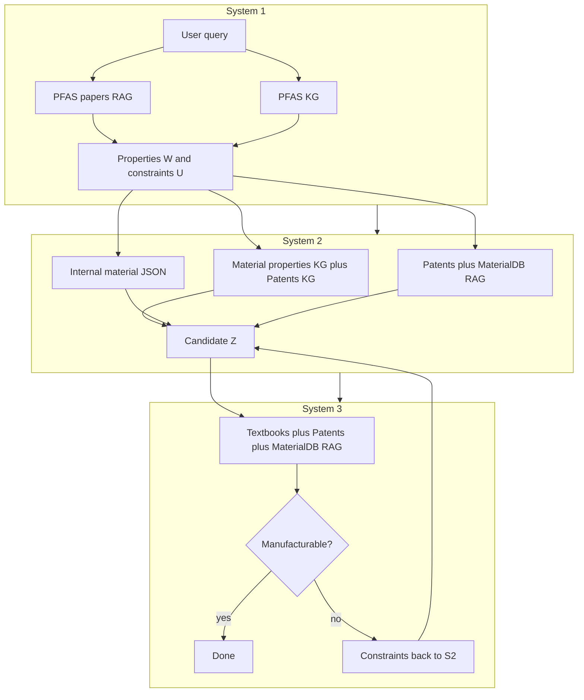

# MARS: System Overview and Knowledge Sources

This document describes what the MARS pipeline does end-to-end, which **knowledge graphs**, **vector (RAG) corpora**, and **structured data** it uses, and **how** each is applied at runtime. Implementation details refer to [`src/runner.py`](../src/runner.py), [`src/pipelines/`](../src/pipelines/), and [`config/config.yaml`](../config/config.yaml).

---

## What MARS Does

**MARS** (Hierarchical Multi-Agent Reasoning for Manufacturability-Aware Material Substitution) is a three-stage LLM workflow that:

1. **System 1 — Property extraction**  
   Reads the user’s material-substitution query and infers **required properties** (keywords) and **hard constraints** for a substitute material, using retrieval and a dedicated PFAS-oriented knowledge graph.

2. **System 2 — Material discovery**  
   Uses those requirements plus application context to **propose substitute candidates**, grounding reasoning in **two large knowledge graphs** (material properties and patents), a **lab material database**, and **RAG** over patents and internal material documentation.

3. **System 3 — Manufacturability assessment**  
   Evaluates whether the proposed candidate can be **made at lab scale**, using **RAG** over manufacturing-oriented text (textbooks when configured), patents, and material DB chunks, plus LLM-structured outputs. If the candidate is **blocked**, the pipeline feeds **new constraints** back to System 2 and repeats until a manufacturable candidate is found or iteration limits are hit.

The orchestrator is **`initialize()`** (load all resources) and **`run_query()`** (run one benchmark query through Systems 1 → 2 ↔ 3). Entry points include [`scripts/run_mars.py`](../scripts/run_mars.py) and the walkthrough notebook.

---

## Knowledge Sources: Inventory

| Kind | Config / location | Loaded in `initialize()` | Used in which stage(s) |
|------|-------------------|----------------------------|-------------------------|
| **KG — Material properties** | `data.graphs.kg_dir` + `material_properties.{graph_file, embedding_file}` | Yes | System 2 (dual-KG subgraph, grounding, `ResearchScientist`) |
| **KG — PFAS** | Same `kg_dir` + `pfas.{graph_file, embedding_file}` | Yes | System 1 only (`ResearchScientist` on PFAS graph) |
| **KG — Patents** | Same `kg_dir` + `patents.{graph_file, embedding_file}` | Yes | System 2 (dual-KG subgraph, grounding, `ResearchScientist` second graph) |
| **RAG — PFAS papers** | `data.chromadb` → `pfas` | Yes | System 1 only (`ResearchAnalyst` on PFAS Chroma collection) |
| **RAG — Patents** | `data.chromadb` → `patents` | Yes | System 2 (`MultiAnalyst`), System 3 (`process_analyst`) |
| **RAG — MaterialDB** | `data.chromadb` → `materialdb` | Yes | System 2 (`MultiAnalyst`), System 3 (`process_analyst`) |
| **RAG — Manufacturing textbooks** | `data.chromadb` → `manufacturing_textbooks` | Yes (required) | System 3 only (`process_analyst`) |
| **RAG — Spec sheets** | `data.chromadb` → `spec_sheets` with `enabled: true` | Only if enabled | System 3 (`process_analyst`), optional |
| **Structured lab inventory** | `data.material_database.path` (JSON) | Yes | System 2 (candidate inventory / property matching context) |

**Embeddings:** A shared [`SentenceTransformer`](https://www.sbert.net/) model (`config.embeddings.model_name`) drives Chroma queries and aligns text with **precomputed node embeddings** for each graph (loaded via `GraphReasoning`).

---

## How Each Source Is Used

### Knowledge graphs (NetworkX + embeddings)

Graphs are stored as **GraphML** with companion **pickled node-embedding** files. Edges use a normalized `relation` attribute for downstream reasoning.

1. **Material properties graph**  
   - **System 2:** Seeds and shortest-path subgraphs connect **property terms** and **lab materials** (from the internal JSON) to relevant nodes.  
   - **Grounding:** [`MaterialGrounding`](../src/utils/material_grounding.py) maps material names to nodes via embedding similarity (`GraphReasoning.find_best_fitting_node_list`).  
   - **Agent:** [`ResearchScientist`](../src/agents/research_scientist.py) runs path-finding and material-class style reasoning on the merged / dual-graph structure.

2. **Patents graph**  
   - **System 2:** Parallel subgraph construction and **cross-graph merging** (embedding-based unification of patent-side nodes with material-property nodes where configured).  
   - **Grounding:** Separate `MaterialGrounding` instance for patent graph nodes.

3. **PFAS graph**  
   - **System 1:** For each generated research question, optional **PFAS KG** queries (`find_connections`) add structured paths when enough keywords are extracted from the question.  
   - **Not** used in System 2’s dual-KG discovery path in the default pipeline.

Together, a **full** `run_query` that executes System 1 and System 2 touches **all three** graphs; System 3 does not query KGs in the default implementation (it relies on RAG + LLM outputs for process evidence).

### Retrieval-augmented generation (ChromaDB)

Chunks are retrieved by **embedding similarity** to the query string. Multiple corpora are combined via [`MultiAnalyst`](../src/agents/multi_analyst.py), which tags each hit with its **source** name and merges results (e.g., by distance).

- **PFAS papers (Chroma):** Attached to **System 1** only. Supports initial retrieval from the user sentence, per-question retrieval, and answers synthesized by `ResearchManager`.

- **Patents + MaterialDB (Chroma):** Used in **System 2** as a `MultiAnalyst` over `patents` and `materialdb` analysts for validation-style questions and evidence. Used again in **System 3** as part of `process_analyst` for process/manufacturing retrieval.

- **Manufacturing textbooks (Chroma):** **Required** at init. Wired into **System 3** `process_analyst` so manufacturability assessment can pull textbook-style process knowledge alongside patents and material DB text.

- **Spec sheets (Chroma):** Optional. If `data.chromadb.spec_sheets.enabled` is **true**, the same Chroma loader runs and a **spec_sheets** analyst is added to `process_analyst` for System 3. If disabled, this corpus is not loaded.

### Internal material database (JSON)

The file at `data.material_database.path` lists **lab materials** and extracted properties. It is loaded into [`MaterialDatabase`](../src/utils/material_database.py) and used in **System 2** to align required properties with concrete materials and to support candidate scoring and subgraph-driven proposals. Initialization **fails** if this file path does not exist.

---

## Pipeline Stages in Detail

### System 1 (`run_fixed_pipeline` in [`material_requirements.py`](../src/pipelines/material_requirements.py))

1. **RAG:** Embed the user sentence (and keywords); retrieve from the **PFAS papers** collection.  
2. **LLM:** `ResearchManager` proposes several **research questions**.  
3. For each question: **RAG** again on that question; optionally query the **PFAS KG** when keyword thresholds are met.  
4. **LLM:** `ResearchManager` answers each question using **RAG chunks** and optional **KG context**.  
5. **LLM:** `ResearchAssistant` extracts **property keywords** and **hard constraints** from answered Q&A.

**Outputs:** `properties_W` (required keywords) and `constraints_U`, passed to System 2.

### System 2 (`run_material_discovery_pipeline` in [`material_discovery.py`](../src/pipelines/material_discovery.py))

1. Build a **dual-KG material-informed subgraph** from **material properties** and **patents** graphs (grounding, shortest-path bundles, merge).  
2. Extract **material classes / KG insights** via `ResearchScientist` on the subgraph.  
3. **Iterate:** propose a candidate, validate with **RAG** (`MultiAnalyst`: patents + materialdb), use `ResearchManager` / LLM steps as configured, track rejections.

**Outputs:** A **candidate** material and evidence for System 3, or failure if no candidate is accepted within limits.

### System 3 (`run_manufacturability_assessment_pipeline` in [`manufacturability_assessment.py`](../src/pipelines/manufacturability_assessment.py))

1. **LLM:** Decompose the candidate into constituents and plan **process-oriented queries**.  
2. **RAG:** For each query, `process_analyst.analyze_question` hits **manufacturing_textbooks**, **patents**, **materialdb**, and **spec_sheets** (if enabled)—each as a separate Chroma-backed analyst behind one `MultiAnalyst`.  
3. **LLM:** Assess manufacturability, produce a recipe or **blocking constraints** and **feedback** for System 2 if blocked.

---

## Strict initialization (`initialize`)

MARS does **not** silently skip missing backends. [`initialize()`](../src/runner.py) validates:

- **`data.graphs.kg_dir`** exists as a directory; each graph’s **`.graphml`** and **embedding `.pkl`** exist.  
- Each **Chroma persist directory** for `pfas`, `patents`, `materialdb`, and **`manufacturing_textbooks`** exists. If `collection_name` is null and the DB has **no collections**, initialization raises a clear **runtime** error.  
- **`data.material_database.path`** exists as a file.  
- **`manufacturing_textbooks`** must be present in config; omission raises **ValueError**.  
- **`spec_sheets`:** if `enabled: true`, **`database_path`** must be set and the Chroma directory must load successfully.

Failures use **`FileNotFoundError`**, **`RuntimeError`**, or **`ValueError`** with paths and config keys called out in the message.

---

## Summary

- **MARS** chains **property extraction → candidate discovery → manufacturability check**, with feedback from System 3 to System 2 when a candidate is not viable.  
- **Three knowledge graphs** cover **material properties**, **PFAS**, and **patents**; a standard full run uses **PFAS in System 1** and **material + patents in System 2**.  
- **RAG** is split by stage: **PFAS papers** in System 1; **patents + MaterialDB** in Systems 2 and 3; **manufacturing textbooks** (and optionally **spec sheets**) in System 3.  
- A **JSON material inventory** grounds lab candidates in System 2.  
- **Initialization is strict:** every required path and Chroma DB must be present and usable before any query runs.

For configuration keys and CLI usage, see [`README.md`](../README.md) and [`config/config.yaml`](../config/config.yaml).
