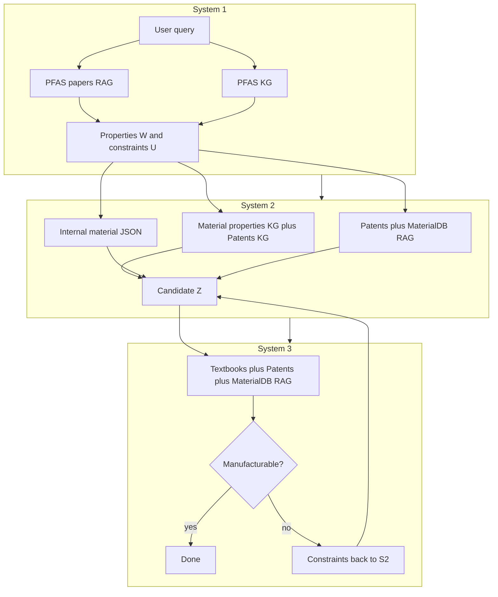

# MARS: System Overview and Knowledge Sources

This document describes what the MARS pipeline does end-to-end, which **knowledge graphs**, **vector (RAG) corpora**, and **structured data** it uses, and **how** each is applied at runtime. Implementation details refer to [`src/runner.py`](../src/runner.py), [`src/pipelines/`](../src/pipelines/), and [`config/config.yaml`](../config/config.yaml).

---

## What MARS Does

**MARS** (Hierarchical Multi-Agent Reasoning for Manufacturability-Aware Material Substitution) is a three-stage LLM workflow that:

1. **System 1 — Property extraction**  
   Reads the user’s material-substitution query and infers **required properties** (keywords) and **hard constraints** for a substitute material, using retrieval and a dedicated PFAS-oriented knowledge graph.

2. **System 2 — Material discovery**  
   Uses those requirements plus application context to **propose substitute candidates**, grounding reasoning in **two large knowledge graphs** (material properties and patents), a **lab material database**, and **RAG** over patents and internal material documentation.

3. **System 3 — Manufacturability assessment**  
   Evaluates whether the proposed candidate can be **made at lab scale**, using **RAG** over manufacturing-oriented text (textbooks when configured), patents, and material DB chunks, plus LLM-structured outputs. If the candidate is **blocked**, the pipeline feeds **new constraints** back to System 2 and repeats until a manufacturable candidate is found or iteration limits are hit.

The orchestrator is **`initialize()`** (load all resources) and **`run_query()`** (run one benchmark query through Systems 1 → 2 ↔ 3). Entry points include [`scripts/run_mars.py`](../scripts/run_mars.py) and the walkthrough notebook.

---

## Knowledge Sources: Inventory

| Kind | Config / location | Loaded in `initialize()` | Used in which stage(s) |
|------|-------------------|----------------------------|-------------------------|
| **KG — Material properties** | `data.graphs.kg_dir` + `material_properties.{graph_file, embedding_file}` | Yes | System 2 (dual-KG subgraph, grounding, `ResearchScientist`) |
| **KG — PFAS** | Same `kg_dir` + `pfas.{graph_file, embedding_file}` | Yes | System 1 only (`ResearchScientist` on PFAS graph) |
| **KG — Patents** | Same `kg_dir` + `patents.{graph_file, embedding_file}` | Yes | System 2 (dual-KG subgraph, grounding, `ResearchScientist` second graph) |
| **RAG — PFAS papers** | `data.chromadb` → `pfas` | Yes | System 1 only (`ResearchAnalyst` on PFAS Chroma collection) |
| **RAG — Patents** | `data.chromadb` → `patents` | Yes | System 2 (`MultiAnalyst`), System 3 (`process_analyst`) |
| **RAG — MaterialDB** | `data.chromadb` → `materialdb` | Yes | System 2 (`MultiAnalyst`), System 3 (`process_analyst`) |
| **RAG — Manufacturing textbooks** | `data.chromadb` → `manufacturing_textbooks` | Yes (required) | System 3 only (`process_analyst`) |
| **RAG — Spec sheets** | `data.chromadb` → `spec_sheets` with `enabled: true` | Only if enabled | System 3 (`process_analyst`), optional |
| **Structured lab inventory** | `data.material_database.path` (JSON) | Yes | System 2 (candidate inventory / property matching context) |

**Embeddings:** A shared [`SentenceTransformer`](https://www.sbert.net/) model (`config.embeddings.model_name`) drives Chroma queries and aligns text with **precomputed node embeddings** for each graph (loaded via `GraphReasoning`).

---

## How Each Source Is Used

This section ties **retrieval mechanics** (how text and graph context are fetched) to **prompt construction** (how that context is turned into LLM input). Shared implementation pieces live in [`ResearchAnalyst`](../src/agents/research_analyst.py) (Chroma only), [`MultiAnalyst`](../src/agents/multi_analyst.py) (multi-corpus Chroma), [`ResearchManager`](../src/agents/research_manager.py) (formatting + YAML prompt templates), and [`initialize()`](../src/runner.py) (wiring collections to agents).

### Shared infrastructure: embeddings and Chroma

- **One embedding model** (`config.embeddings.model_name`, loaded in `initialize()`) backs both **Chroma queries** and **KG node alignment**: the same `SentenceTransformer` + `TransformerEmbeddingFunction` is passed when opening each persisted Chroma database and when matching text to graph nodes.
- **Chroma retrieval** is always `collection.query(query_texts=[...], n_results=..., include=["documents", "metadatas", "distances"])`. Distances are **lower = more similar** for the configured space; downstream code sorts merged lists by distance when combining sources.

### How RAG is retrieved (`ResearchAnalyst`)

`ResearchAnalyst` does **not** call an LLM; it only queries Chroma.

1. **Query expansion:** For each call, it requests `n_results * rag_query_multiplier` hits (`agents.research_analyst`: default `n_results: 5`, `rag_query_multiplier: 20`), i.e. up to 100 candidates before filtering.
2. **Keyword filter (optional):** If the caller passes keywords, each document must contain **every** keyword as a case-insensitive substring (`analyze` path). This is used in System 1 when `run_query` passes `keywords=[material_X, application_Y]`.
3. **Distance filter (optional):** If `distance_threshold` is set on the analyst, chunks beyond that distance are dropped.
4. **Cap:** Scanning in Chroma’s order, the analyst keeps hits until it has `n_results` items (or runs out).
5. **Per-hit payload** passed to the LLM layer: `content`, `distance`, `id`, `metadata` (and later `source` when wrapped by `MultiAnalyst`).

**System 1 fallback:** If the keyword-filtered retrieval returns **zero** documents, `run_fixed_pipeline` retries with `analyze_question(sentence)` (no keywords), so the pipeline can still proceed when strict substring matching is too harsh.

### How multi-corpus RAG is merged (`MultiAnalyst`)

`MultiAnalyst` holds a **dict of named** `ResearchAnalyst` instances (e.g. `{"patents": ..., "materialdb": ...}`). For each user string or question it:

1. Queries **every** analyst independently (same `analyze` / `analyze_question` rules as above).
2. Tags each hit with a string field **`source`** equal to that dict key.
3. **Concatenates** all hits and sorts **globally** by `distance` ascending.

There is **no** separate “top-k across corpora” cap inside `MultiAnalyst` itself: you get up to `n_results` **per** underlying analyst before the merge sort. The LLM side may still **truncate** how many chunks enter a particular prompt (see below).

### How retrieved text is injected into prompts (`ResearchManager`)

`ResearchManager` turns RAG hits into prose with `_format_rag_context`:

- Enumerates documents as `[Document 1]`, `[Document 2]`, …
- If present, emits **`Source:`** (critical for `MultiAnalyst` output), **`ID:`**, **`Metadata:`**, then **`Content:`** (possibly truncated).

Truncation and budgets are controlled under `agents.research_manager`:

| Setting | Role |
|--------|------|
| `formatting.max_chars_per_result` | Default cap per chunk in generic / question-generation prompts |
| `formatting.max_chars_per_result_answer` | Per chunk when **answering** a question (`answer_question`) |
| `formatting.max_chars_per_result_validation` | Chunks for validation-oriented prompts (e.g. initial process-query context) |
| `formatting.max_chars_per_result_feasibility` | Recipe / feasibility synthesis |
| `context_limits.max_rag_results_in_context` | Hard slice `rag_results[:N]` in some code paths (e.g. seeding process-query generation) |
| `max_prompt_chars` | Safety truncation of an entire assembled user prompt (with a warning) |

YAML templates in [`config/prompts.yaml`](../config/prompts.yaml) use **placeholders** such as `{rag_context}`, `{question}`, `{kg_context}`, `{kg_instruction}`. For example, `answer_question` builds:

- `rag_context_str` from formatted documents (or a fixed “no documents” line),
- optional `kg_context_str` from `_format_kg_context` when PFAS KG paths exist,
- then fills `agents.research_manager.answer_question_user_prompt`.

**KG path formatting** (`_format_kg_context`): only runs when `summary.connections_found` is true; it summarizes counts and includes **serialized paths** (up to `formatting.max_paths`) so the model sees explicit node-to-node chains, not just free text.

### Knowledge graphs: retrieval and use

Graphs are **GraphML** + **pickled per-node embeddings**. Edge labels are read preferentially from the `relation` attribute (see `_get_edge_label` in `ResearchManager`).

#### PFAS graph — System 1

- **Keyword gating:** For each research question, `_extract_keywords_from_question` strips stop words and keeps up to `pipelines.material_requirements.max_keywords` terms. The PFAS KG runs only if `len(question_keywords) >= min_question_keywords` (default **2**).
- **Query:** `ResearchScientist.find_connections` embeds keywords, maps them to nodes, searches paths (see `research_scientist` path-finding settings), returns a structured dict.
- **Prompt injection:** If connections exist, `answer_question` appends the formatted KG block plus an instruction to weigh **both** documents and graph relationships.

#### Material + Patents graphs — System 2 (dual subgraph)

Step 1 (`run_material_substitution_step`) builds one **material-informed** subgraph:

1. **Ground lab materials** in the material-properties KG (`ground_material_database`) → seed node IDs.
2. **Map required property strings** to nodes in **both** KGs via `map_terms_to_nodes_best_match` (embedding similarity, capped counts from `dual_kg_material_informed_subgraph`).
3. **Build** `subgraph_matkg` and `subgraph_patkg` with `build_connection_subgraph_shortest_paths` (undirected shortest paths between seed pairs, subject to `max_pairs_evaluated`, `max_shortest_path_len`, `max_nodes_total`).
4. **Merge** with `merge_subgraphs_unify_by_embedding`: patent nodes can be **unified** onto material-KG nodes when cosine similarity of node embeddings exceeds `merge_similarity_threshold`.

Downstream:

- **`ResearchScientist.map_properties_to_materials`** runs on this **merged** subgraph (not the full global graphs) to derive material classes and path statistics.
- **`extract_subgraph_insights`** batches **node lists** (attributes like `title`, `label`, `name`, `description`) into LLM prompts (`pipelines.material_discovery` prompts) to classify nodes as material-like vs property-like; results are capped by `batch_nodes_for_llm_context`.
- **Candidate loop:** `generate_validation_queries` / `validate_feasibility` can receive **optional** `kg_context` / `kg_evidence` derived from the same subgraph (e.g. node IDs whose string label contains the candidate name) so prompts can mention **local** KG hooks—not full graph dumps.

**Note:** System 3 does **not** load or query these large KGs by default; it relies on Chroma-backed process evidence and structured LLM outputs.

### Internal material database (JSON)

[`MaterialDatabase`](../src/utils/material_database.py) is loaded once in `initialize()`; missing path → **hard failure**.

In System 2 it feeds:

- **Seeding the dual subgraph:** grounded material nodes come from every entry’s `material_name` (and related fields) via `MaterialGrounding`.
- **Property / substitution logic** elsewhere in the discovery pipeline (ranking context, proposals—see `material_discovery.py` and `PropertyMapper` where configured).

The JSON is **not** embedded into Chroma by this pipeline; the **MaterialDB Chroma collection** is a separate vector index that often mirrors or extends that structured inventory as unstructured chunks.

---

### End-to-end by stage (retrieval → prompt → next step)

#### System 1 — [`run_fixed_pipeline`](../src/pipelines/material_requirements.py)

| Step | Retrieval | Injected into prompt via |
|------|-----------|---------------------------|
| Question generation | `ResearchAnalyst.analyze(sentence, keywords)` on **PFAS papers** | `ResearchManager.process` ← `process_user_prompt` with `{rag_context}`, `{sentence}`, `{keywords_section}` |
| Per-question evidence | `analyze_question(question)` on PFAS papers; optional `pfas_scientist.find_connections` | `answer_question` ← `answer_question_user_prompt` with RAG + optional KG blocks |
| Property / constraint extraction | No new retrieval | `ResearchAssistant` prompts using **answered** Q&A text only |

Optional **parallel RAG workers** (`parallel_rag_workers` set above 1) run per-question RAG+KG work in a thread pool; ordering of `question_results` is preserved to match `manager_result`.

#### System 2 — [`run_material_discovery_pipeline`](../src/pipelines/material_discovery.py)

| Phase | Sources | Mechanism |
|-------|---------|-----------|
| Substitution | Mat KG + Patents KG + material JSON | Dual subgraph + merge (above); LLM subgraph insight extraction |
| Iteration | **`MultiAnalyst`** `{patents, materialdb}` | For each validation query string: `analyst.analyze_question(query)` returns tagged hits; `answer_question` compresses each query’s evidence |
| Feasibility | RAG answers + optional subgraph hints | `validate_feasibility` assembles evidence summaries (see `max_chars_per_result_feasibility` / validation prompts in YAML) |

The `ResearchAnalyst` passed from [`run_query`](../src/runner.py) is a **`MultiAnalyst`** over patents and materialdb collections (`n_results` from `agents.research_analyst`).

#### System 3 — [`run_manufacturability_assessment_pipeline`](../src/pipelines/manufacturability_assessment.py)

`initialize()` builds `process_analyst` as a `MultiAnalyst` over **manufacturing_textbooks**, **patents**, and **materialdb** (and **spec_sheets** if enabled). Each underlying `ResearchAnalyst` uses `pipelines.manufacturability_assessment.n_results_per_source` (see [`config/config.yaml`](../config/config.yaml)).

| Step | Retrieval | How it reaches the LLM |
|------|-----------|-------------------------|
| **A. Constituents** | None | `extract_material_constituents_for_manufacturing` — structured JSON (composite vs single) from candidate + application + constraints |
| **B. Decomposition query plan** | None | `generate_decomposition_process_queries` — LLM emits constituent- and combination-type search strings from the decomposition JSON (no Chroma call in this step) |
| **C. First-pass process evidence** | For **each** planned query string: `process_analyst.analyze_question` | Hits are tagged by corpus, concatenated, sorted by distance, then **deduplicated** (source + id + content hash) and **source-balanced** up to `max_process_families`. This list becomes `retrieved_rag_results`. |
| **D. Feasibility question generation** | Uses **only** the evidence from C | `generate_feasibility_questions` formats `retrieved_rag_results` into the prompt so the model asks targeted follow-ups grounded in what was already retrieved. |
| **E. Per-question refinement** | For **each** feasibility question: `process_analyst.analyze_question` again | `answer_feasibility_question` injects that question’s RAG hits (confidence + “evidence used” metadata). |
| **F. Overall verdict** | None new | `assess_manufacturability_feasibility` aggregates the Q&A pairs (and coverage stats); no additional retrieval. |
| **G. Recipe (if feasible)** | Reuses **C** | `synthesize_process_recipe` formats **`retrieved_rag_results`** from step C (not the per-question lists from E) via `_format_rag_context` with `max_chars_per_result_feasibility`. |

**Note:** `ResearchManager.generate_process_retrieval_queries` performs an initial `process_analyst` query and injects snippets into a **different** prompt path; the default manufacturability pipeline above uses the **decomposition** flow instead (A–G). The helper remains available for alternate entry points or experiments.

---

## Pipeline Stages in Detail

### System 1 (`run_fixed_pipeline` in [`material_requirements.py`](../src/pipelines/material_requirements.py))

1. **RAG:** Embed the user sentence (and keywords); retrieve from the **PFAS papers** collection.  
2. **LLM:** `ResearchManager` proposes several **research questions**.  
3. For each question: **RAG** again on that question; optionally query the **PFAS KG** when keyword thresholds are met.  
4. **LLM:** `ResearchManager` answers each question using **RAG chunks** and optional **KG context**.  
5. **LLM:** `ResearchAssistant` extracts **property keywords** and **hard constraints** from answered Q&A.

**Outputs:** `properties_W` (required keywords) and `constraints_U`, passed to System 2.

### System 2 (`run_material_discovery_pipeline` in [`material_discovery.py`](../src/pipelines/material_discovery.py))

1. Build a **dual-KG material-informed subgraph** from **material properties** and **patents** graphs (grounding, shortest-path bundles, merge).  
2. Extract **material classes / KG insights** via `ResearchScientist` on the subgraph.  
3. **Iterate:** propose a candidate, validate with **RAG** (`MultiAnalyst`: patents + materialdb), use `ResearchManager` / LLM steps as configured, track rejections.

**Outputs:** A **candidate** material and evidence for System 3, or failure if no candidate is accepted within limits.

### System 3 (`run_manufacturability_assessment_pipeline` in [`manufacturability_assessment.py`](../src/pipelines/manufacturability_assessment.py))

1. **LLM:** Constituent decomposition, then a **structured query plan** (no RAG in those two steps).  
2. **RAG:** Run the plan through `process_analyst` (textbooks + patents + materialdb + optional spec sheets), dedupe and cap evidence.  
3. **LLM:** Generate **feasibility questions** informed by that evidence; **RAG again** per question; aggregate with `assess_manufacturability_feasibility`.  
4. If feasible: **LLM** `synthesize_process_recipe` using the step-2 evidence list; if blocked: emit constraints and **feedback** for System 2.

---

## Strict initialization (`initialize`)

MARS does **not** silently skip missing backends. [`initialize()`](../src/runner.py) validates:

- **`data.graphs.kg_dir`** exists as a directory; each graph’s **`.graphml`** and **embedding `.pkl`** exist.  
- Each **Chroma persist directory** for `pfas`, `patents`, `materialdb`, and **`manufacturing_textbooks`** exists. If `collection_name` is null and the DB has **no collections**, initialization raises a clear **runtime** error.  
- **`data.material_database.path`** exists as a file.  
- **`manufacturing_textbooks`** must be present in config; omission raises **ValueError**.  
- **`spec_sheets`:** if `enabled: true`, **`database_path`** must be set and the Chroma directory must load successfully.

Failures use **`FileNotFoundError`**, **`RuntimeError`**, or **`ValueError`** with paths and config keys called out in the message.

---

## Summary

- **MARS** chains **property extraction → candidate discovery → manufacturability check**, with feedback from System 3 to System 2 when a candidate is not viable.  
- **Three knowledge graphs** cover **material properties**, **PFAS**, and **patents**; a standard full run uses **PFAS in System 1** and **material + patents in System 2**.  
- **RAG** is split by stage: **PFAS papers** in System 1; **patents + MaterialDB** in Systems 2 and 3; **manufacturing textbooks** (and optionally **spec sheets**) in System 3.  
- A **JSON material inventory** grounds lab candidates in System 2.  
- **Initialization is strict:** every required path and Chroma DB must be present and usable before any query runs.

For configuration keys and CLI usage, see [`README.md`](../README.md) and [`config/config.yaml`](../config/config.yaml).
